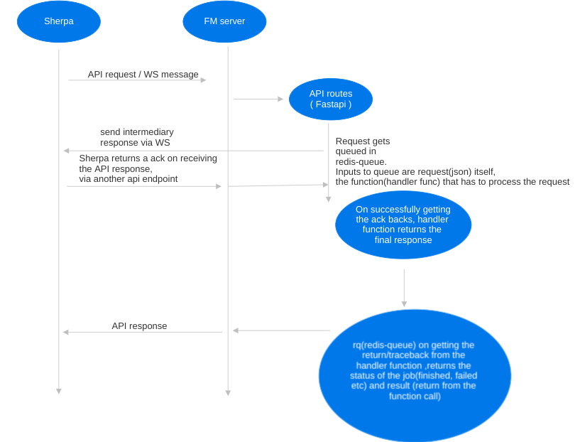

# Dev Help #

## Index ## 

1. [How to update poetry packages?](#how-to-update-poetry-packages)
2. [ Message flow from sherpa to FM ](#message-flow-from-sherpa-to-fm)

## How to update poetry packages? ##

1. Update the package inside the docker and commit the pyproject.toml and poetry.lock to the repository

```
docker exec -it fleet_manager/<some repo> bash
poetry update <package_name> 
```

2. If the poetry update was successful
```
docker cp fleet_manager:/app/pyproject.toml <fleet_manager_repo>
docker cp fleet_manager:/app/poetry.lock <fleet_manager_repo>
```

3. Commit the changes done on pyproject.toml,poetry.lock to the repository.

4. Base images have to be created once the packages are updated 


## Message flow from sherpa to FM ##


