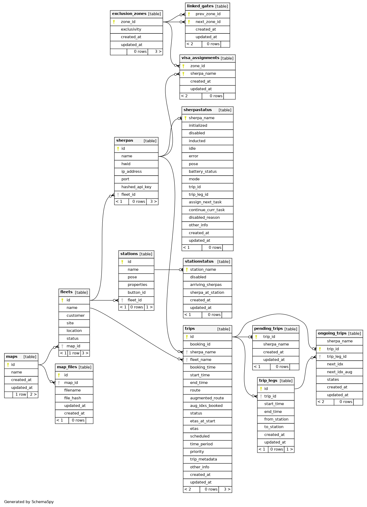

# Fleet Manager (FM) Overview

---


## Functionalitites of FM ##

1. Configure and operate fleets, stations, sherpas 

    ```
    - Auto hitch at station A 
    - Auto Unhitch at station B 
    - Wait for dispatch button press at Station C
    ```

        
2. Optimal task assignment to minimise waiting time, maximise throughput

    ```
    Sherpa 1 - Trip 1 - (Route A -> B -> C)
    Sherpa 2 - Trip 2 - (Route E -> F )
    ``` 
---

# Functionalitites of FM 


3. Traffic management - To prevent deadlocks

    ```
    Exclusive access of an area for parking, unparking, transit
    ```
     
4. Dynamic control of fleet - Fleet start, stop , emergency stop etc

5. Facilitate communication between a sherpa and another smart device(conveyor, another sherpa)

---

# FM Backed implementation 

1. FM is ASGI REST API implementation done using Fastapi

2. Advantages of using fastapi

```
- Fast: Very high performance, on par with Nodejs

- Inbuilt validation of requests, done using pydantic 

- Automatic interactive documentation. 

```
---

# Trpical message flow in FM 

1. From Dashboard - 
    ```
    # trip booking request
    {
        "route" : ["A", "B", "C"]
        "start_time": "2023-11-05 14:00:00"
    }
    ```

2. FM backend 
    - Recieves, validates the request body
    
    - Create a Job in FIFO RQ job queue
        ```
        queues handle_book(request)
        ```
---

3. Handle book
    
    - RQ executes handle book on the background 

    - Creates a trip entry, pending_trip entry in the Database 

```
Trip table
```
| trip_id | route  |  sherpa_name | status |
| -------- | -------  | -------- | -------- |
| 10 | A, B, C | Sherpa1| "booked"|

---


```
Pending trip
```
|  trip_id | sherpa_name |
| -------- | -------  | 
| 12 | Sherpa 1 |     


4. On success of handle book the changes are commited to DB else the changes made will be rolled back


5. Backend return a reponse with status code 200, meaning success to the Dashboard
    
---

# Databases - PSQL 

1. We use relational databases to store information of the sherpas, map files info, trips, traffic management(locks on areas)

2. Schema, Relationship of each entry will be cleary defined, gets validated at the time of commiting 

3.  For instance, fleet will be related sherpa by one-to-many relationship, sherpa to fleet by one-one relationship


---



